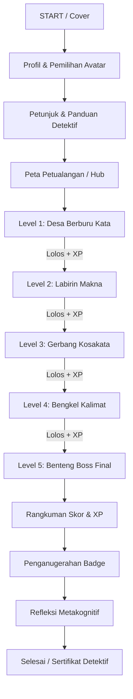

# GAME DESIGN DOCUMENT (GDD)
# "PETUALANGAN DETEKTIF KOSAKATA"
### *Temukan Kata, Pecahkan Makna, Taklukkan Tantangan!*

**Mata Pelajaran:** Bahasa Indonesia  
**Jenjang / Fase:** SMP / Fase D (Kelas IX Semester 1)  
**Materi Pokok:** Mengeksplorasi Kosakata dalam Teks Cerita (Makna Kontekstual, Denotasi vs. Konotasi, Kata Umum vs. Kata Khusus, dan Penggunaan Kalimat Efektif)  
**Media:** Canva Presentation Interaktif (Hyperlink Matrix) & Responsive Mobile Web Application  

---

## 1. PENDAHULUAN & FILOSOFI DESAIN

### 1.1 Latar Belakang & Masalah Pembelajaran
Dalam membaca teks cerita (cerpen, fabel, atau novel), siswa kelas IX SMP kerap menemukan kosakata arkais, serapan, maupun kata bermakna konotatif yang belum akrab dalam percakapan harian. Metode konvensional seperti menyalin arti dari Kamus Besar Bahasa Indonesia (KBBI) sering kali membuat siswa bosan dan pasif. 

Game edukasi **"Petualangan Detektif Kosakata"** mengubah cara belajar tersebut menjadi investigasi aktif (*inquiry-based gamification*). Siswa tidak sekadar disodori definisi matang, melainkan ditantang menjadi detektif bahasa yang menelusuri jejak konteks kalimat, menyimpulkan makna tersirat, membedakan nuansa rasa kata (konotasi), hingga merakit kalimat kreasi mereka sendiri.

### 1.2 Profil Karakter & Pengguna
- **Audiens Sasaran:** Siswa SMP Kelas IX (usia 14–15 tahun).
- **Karakteristik Psikologis:** Menyukai tantangan yang adil (*achievable difficulty*), kompetisi sehat (XP & Badge), visual modern 3D isometrik, dan kemandirian dalam mengambil keputusan.
- **Karakter Utama:** Siswa detektif SMP berpakaian rompi navy dan seragam rapi, bersenjatakan buku jurnal petualangan dan kaca pembesar ajaib.

---

## 2. TUJUAN PEMBELAJARAN (INSTRUCTIONAL OBJECTIVES)

Berlandaskan Capaian Pembelajaran (CP) Bahasa Indonesia Fase D, setelah menyelesaikan petualangan ini, siswa mampu:
1. **Mengidentifikasi** kosakata baru, kunci, dan emotif dalam teks cerita.
2. **Mendeduksi makna** kosakata berdasarkan petunjuk konteks (*context clues*) kalimat di sekitarnya.
3. **Mengartikulasikan definisi** kosakata menggunakan bahasa sendiri secara logis dan komunikatif.
4. **Membedakan makna denotatif** (makna lugas/sebenarnya) dan **makna konotatif** (makna kias/tambahan nuansa rasa) secara tepat.
5. **Mengklasifikasikan kata umum** (hipernim) dan **kata khusus** (hiponim) untuk memperkaya variasi ekspresi.
6. **Mengonstruksi kalimat baru** yang efektif, gramatikal, dan kontekstual menggunakan kosakata yang telah dipelajari.
7. **Menguraikan alasan** logis atas pemilihan makna suatu kata dalam cerita.
8. **Menginternalisasi Profil Pelajar Pancasila:** Bernalar Kritis (menganalisis petunjuk makna), Kreatif (menyusun kalimat), Mandiri, dan Bergotong Royong (pada mode permainan kelompok).

---

## 3. CORE GAMEPLAY & MEKANIKA GAME

### 3.1 Sistem XP (Experience Points) & Gelar Detektif
Sistem skor dirancang transparan dan memotivasi peningkatan bertahap:
- **Tiap Jawaban Tepat (Level 1-3 & Level 5):** `+10 XP`
- **Bonus Penyelesaian Level:** `+20 XP` per level tuntas
- **Penyelesaian Kalimat Kreatif (Level 4):** Maksimal `+30 XP` (berdasarkan rubrik)
- **Bonus Menaklukkan Boss Final:** `+50 XP`
- **Total Maksimal XP:** Hingga **250+ XP**

| Rentang Skor XP | Gelar Detektif | Deskripsi Pencapaian |
| :--- | :--- | :--- |
| **0 – 49 XP** | 🥉 **Penjelajah Pemula** | Mulai memahami cara mengamati kata dalam teks. |
| **50 – 99 XP** | 🥈 **Pemburu Kosakata** | Berhasil mendeteksi kosakata kunci dan petunjuk kalimat. |
| **100 – 149 XP** | 🥇 **Detektif Kosakata** | Mahir membedakan kata umum/khusus serta makna denotatif. |
| **150 – 199 XP** | 💎 **Detektif Ahli** | Piawai menafsirkan konotasi dan merangkai kalimat ekspresif. |
| **200+ XP** | 👑 **MASTER DETEKTIF KOSAKATA** | Sempurna menaklukkan seluruh rintangan bahasa Indonesia! |

### 3.2 Sistem Lencana Prestasi (Badges)
1. 🔎 **Mata Elang Kata**: Diberikan setelah menemukan minimal 5 kosakata tersembunyi pada Level 1.
2. 📖 **Pemburu Makna**: Diberikan setelah memecahkan teka-teki petunjuk konteks pada Level 2.
3. 🧠 **Ahli Konteks**: Diberikan setelah berhasil mengelompokkan kata ke 3 Gerbang pada Level 3.
4. ✍️ **Perakit Kalimat**: Diberikan setelah merakit 3 kalimat orisinal yang logis pada Level 4.
5. 👑 **Master Detektif**: Diberikan setelah menyelesaikan tantangan komprehensif Boss Final pada Level 5.

---

## 4. TEKS CERITA UTAMA LEVEL 1: "RAHASIA RUANG SUNYI PERPUSTAKAAN"

> **Panjang Teks:** 182 kata  
> **Tema:** Penjelajahan perpustakaan sekolah kuno yang sarat buku-buku berharga.
>
> Di sudut timur SMP Bintang Kejora, terdapat sebuah ruangan tua yang jarang dikunjungi siswa. Pagi itu, Rian memberanikan diri untuk **menjelajah** ke dalam ruangan tersebut. Suasana di dalam begitu **sunyi**, hanya terdengar derit langkah kakinya di atas lantai kayu jati yang berdebu. Sinar matahari pagi menembus celah jendela kaca patri, menyoroti rak-rak buku tua yang berderet tinggi hingga menyentuh langit-langit.
>
> Dengan rasa **antusias** yang membara di dalam dada, Rian mulai **menelusuri** lorong demi lorong rak sastra klasik. Tiba-tiba, matanya tertumbuk pada sebuah buku tebal bersampul beludru biru tua dengan ukiran aksara emas yang memancarkan kilau lembut. Ia **terpukau** menatap keindahan ilustrasi di halaman pembukanya, membayangkan kisah-kisah petualangan pahlawan nusantara yang tersimpan rapi selama puluhan tahun. Aroma wangi kertas tua membangkitkan dahaganya akan ilmu pengetahuan, mengubah rasa penasaran biasa menjadi petualangan akbar mengungkap misteri kosakata masa lalu.

---

## 5. DETAIL KONTEN TIAP LEVEL & KUNCI JAWABAN

### LEVEL 1: DESA BERBURU KATA
- **Misi:** Temukan minimal 5 kosakata penting/menarik dari cerita dan kumpulkan ke dalam Buku Catatan Detektif.
- **Kosakata Target:**
  1. *Menjelajah* (+10 XP)
  2. *Sunyi* (+10 XP)
  3. *Antusias* (+10 XP)
  4. *Menelusuri* (+10 XP)
  5. *Terpukau* (+10 XP)
- **Mekanisme:** Klik kartu kata yang muncul di teks. Setiap kata memicu efek kaca pembesar dan kartu catatan detektif.

### LEVEL 2: LABIRIN MAKNA (5 TANTANGAN)
Setiap tantangan menguji kemampuan siswa menemukan petunjuk konteks kalimat:

1. **Tantangan 1 (Kata: *Menjelajah*)**
   - *Konteks:* "Rian memberanikan diri untuk **menjelajah** ke dalam ruangan tersebut."
   - *Pertanyaan:* Berdasarkan konteks kalimat tersebut, makna kata *menjelajah* adalah...
   - *Pilihan:*
     - A. Mengunjungi tempat baru untuk menyelidiki dan mencari tahu (KUNCI)
     - B. Berlari cepat menghindari bahaya yang mengancam
     - C. Menutup ruangan agar tidak dimasuki orang lain
   - *Pembahasan:* Rian pergi ke ruangan tua yang belum pernah ia masuki dengan niat mencari tahu isinya.

2. **Tantangan 2 (Kata: *Sunyi*)**
   - *Konteks:* "Suasana di dalam begitu **sunyi**, hanya terdengar derit langkah kakinya..."
   - *Pertanyaan:* Petunjuk kata "hanya terdengar derit langkah kakinya" membuktikan bahwa kata *sunyi* bermakna...
   - *Pilihan:*
     - A. Gelap gulita tanpa penerangan lampu
     - B. Senyap, hening, dan tidak ada suara gaduh (KUNCI)
     - C. Ramai oleh perbincangan para siswa
   - *Pembahasan:* Frasa "hanya terdengar derit langkah kaki" menandakan keadaan yang sangat hening/senyap.

3. **Tantangan 3 (Kata: *Antusias*)**
   - *Konteks:* "Dengan rasa **antusias** yang membara di dalam dada, Rian mulai mencari..."
   - *Pertanyaan:* Makna kata *antusias* yang tepat sesuai kalimat di atas adalah...
   - *Pilihan:*
     - A. Semangat besar dan penuh gairah minat (KUNCI)
     - B. Rasa takut dan cemas yang mendalam
     - C. Ragu-ragu dalam mengambil keputusan
   - *Pembahasan:* Kata "membara di dalam dada" menunjukkan adanya gairah semangat positif yang tinggi.

4. **Tantangan 4 (Kata: *Menelusuri*)**
   - *Konteks:* "Rian mulai **menelusuri** lorong demi lorong rak sastra klasik."
   - *Pertanyaan:* Berdasarkan kalimat di atas, makna *menelusuri* adalah...
   - *Pilihan:*
     - A. Berjalan mengikuti alur atau jejak rak secara saksama (KUNCI)
     - B. Merobohkan susunan rak buku satu per satu
     - C. Menghitung jumlah kayu pada rak buku
   - *Pembahasan:* Berjalan menyusuri sepanjang jalur lorong rak untuk mencari buku.

5. **Tantangan 5 (Kata: *Terpukau*)**
   - *Konteks:* "Ia **terpukau** menatap keindahan ilustrasi di halaman pembukanya..."
   - *Pertanyaan:* Makna kata *terpukau* berdasarkan kalimat tersebut adalah...
   - *Pilihan:*
     - A. Terpesona dan sangat kagum sehingga perhatiannya terpusat (KUNCI)
     - B. Mengantuk dan bosan melihat gambar
     - C. Kecewa karena gambar tidak berwarna
   - *Pembahasan:* Terpikat oleh keindahan visual ilustrasi buku tersebut.

---

### LEVEL 3: GERBANG KOSAKATA (KATEGORISASI KATA)
Siswa memilah 8 kartu kata ke dalam 3 Gerbang Utama:
1. 🚪 **Gerbang Kata Umum (Hipernim):** Kata yang memiliki ruang lingkup luas dan membawahi kata-kata lain.
2. 🚪 **Gerbang Kata Khusus (Hiponim):** Kata yang memiliki ruang lingkup sempit, spesifik, dan merupakan bagian dari kata umum.
3. 🚪 **Gerbang Makna Konotatif:** Kata atau ungkapan yang mengandung makna kiasan/nuansa rasa tambahan, bukan arti harfiah.

| Kartu Kata | Gerbang yang Benar | Penjelasan Edukatif |
| :--- | :--- | :--- |
| **HEWAN** | 🚪 Kata Umum | Membawahi berbagai jenis satwa seperti burung, ikan, reptil. |
| **BURUNG** | 🚪 Kata Umum / Khusus | Dalam relasi dengan Elang, Burung adalah kata umum; sedangkan Elang adalah khususnya. |
| **ELANG** | 🚪 Kata Khusus | Jenis satwa spesifik di bawah kategori burung/hewan. |
| **KENDARAAN** | 🚪 Kata Umum | Membawahi sepeda, mobil, motor, kereta. |
| **SEPEDA** | 🚪 Kata Khusus | Jenis transportasi spesifik di bawah kendaraan. |
| **BUAH TANGAN** | 🚪 Makna Konotatif | Memiliki makna kiasan "oleh-oleh", bukan buah yang memiliki tangan. |
| **BUNGA** | 🚪 Kata Umum | Membawahi aneka ragam tanaman bunga (mawar, melati, anggrek). |
| **MAWAR** | 🚪 Kata Khusus | Jenis spesifik dari bunga berduri wangi. |

---

### LEVEL 4: BENGKEL KALIMAT (PRODUKSI KALIMAT KREATIF)
Siswa memilih 3 dari 5 kosakata (*antusias, terpukau, menelusuri, sunyi, menakjubkan*) dan mengetikkan kalimat ciptaannya ke dalam formulir interaktif:

**Rubrik Penilaian Responsif (Skor 1 - 4):**
- **Skor 4 (Sangat Tepat):** Konteks makna kata tepat sasaran, struktur kalimat berpola SPOK lengkap/logis, ejaan dan huruf kapital benar.
- **Skor 3 (Tepat):** Makna kata tepat, kalimat mudah dipahami, terdapat kesalahan minor tanda baca.
- **Skor 2 (Cukup Tepat):** Makna kata sedikit tertukar atau kalimat rancu/ambigu.
- **Skor 1 (Perlu Perbaikan):** Makna kata tidak sesuai konteks sama sekali.

*Fitur Asisten Detektif Otomatis:* Menyediakan tombol "Contoh Kalimat Teladan" dan validasi panjang kalimat minimal 5 kata.

---

### LEVEL 5: BENTENG BOSS FINAL (10 SOAL MASTER DETEKTIF)

1. **Soal 1 (Identifikasi Kosakata):**  
   *Kalimat:* "Rian merasakan **atmosfer** magis saat menginjakkan kaki di ruang arsip tua."  
   Kata *atmosfer* dalam kalimat cerita di atas menunjukkan...  
   - A. Lapisan udara bumi  
   - B. Suasana atau keadaan lingkungan sekitar (KUNCI)  
   - C. Suhu udara yang panas  
   - *Umpan Balik:* Atmosfer di sini bermakna metaforis untuk "suasana batin/lingkungan".

2. **Soal 2 (Makna Konteks):**  
   *Kalimat:* "Detektif itu menatap jejak kaki dengan **saksama** tanpa melewatkan sebutir debu pun."  
   Kata *saksama* bermakna...  
   - A. Tergesa-gesa  
   - B. Teliti dan cermat (KUNCI)  
   - C. Santai dan acuh  

3. **Soal 3 (Makna Denotatif):**  
   Manakah kalimat di bawah ini yang menggunakan kata bermakna **denotatif** (makna lugas/sebenarnya)?  
   - A. Meja hijau itu memutuskan perkara dengan adil  
   - B. Ayah mengecat meja belajar adik dengan warna hijau (KUNCI)  
   - C. Pemuda itu menjadi kambing hitam dalam perselisihan warga  

4. **Soal 4 (Makna Konotatif):**  
   Dalam kalimat "Kutu buku itu akhirnya memenangi olimpiade sains", frasa *kutu buku* mengandung makna konotatif, yaitu...  
   - A. Serangga kecil perusak kertas perpustakaan  
   - B. Orang yang sangat gemar membaca dan belajar (KUNCI)  
   - C. Buku pelajaran yang sudah usang dan berdebu  

5. **Soal 5 (Kata Umum):**  
   Di antara kelompok kata berikut, manakah yang merupakan **kata umum (hipernim)**?  
   - A. Melihat (KUNCI)  
   - B. Melirik  
   - C. Mengintip  
   - *Pembahasan:* Melirik dan mengintip adalah cara khusus dari aktivitas "melihat".

6. **Soal 6 (Kata Khusus):**  
   Manakah kata khusus dari kata umum *keindahan* atau *warna*?  
   - A. Benda  
   - B. Jingga (KUNCI)  
   - C. Pakaian  

7. **Soal 7 (Penggunaan Kata Efektif):**  
   Pilihlah kalimat yang menggunakan kata *antusias* secara tepat dan gramatikal:  
   - A. Para siswa menyambut lomba membaca cerpen dengan sangat antusias. (KUNCI)  
   - B. Hujan lebat berlangsung sangat antusias sepanjang malam.  
   - C. Meja tua itu tampak antusias diletakkan di pojok kelas.  

8. **Soal 8 (Makna Kata dalam Teks Cerita):**  
   *Kalimat:* "Aroma kertas tua itu membangkitkan **dahaganya** akan ilmu pengetahuan."  
   Kata *dahaga* dalam teks tersebut bermakna...  
   - A. Rasa haus ingin minum segelas air  
   - B. Keinginan atau kerinduan yang sangat kuat untuk belajar (KUNCI)  
   - C. Sakit tenggorokan karena debu ruangan  

9. **Soal 9 (Analisis Kalimat):**  
   Kalimat: *"Rian menelusuri lorong perpustakaan dengan santai tetapi waspada."*  
   Alasan pemilihan kata *menelusuri* lebih tepat daripada *berlari* adalah karena...  
   - A. Rian sedang terburu-buru pulang sekolah  
   - B. Rian sedang mengamati dan mencari buku secara runtut di lorong (KUNCI)  
   - C. Ruangan perpustakaan sangat sempit untuk berjalan  

10. **Soal 10 (Simpulan Makna Cerita):**  
    Berdasarkan keseluruhan cerita petualangan Rian, kata *mengeksplorasi* kosakata mencerminkan sikap pembaca yang...  
    - A. Pasif menunggu guru memberi tahu jawaban  
    - B. Aktif, kritis, dan penasaran menyelidiki rahasia makna di balik cerita (KUNCI)  
    - C. Menghafal seluruh isi kamus tanpa memahami konteks  

---

## 6. STORYBOARD 30 SCENE UNTUK CANVA & MOBILE WEB

Dokumen ini memetakan arsitektur slide Canva ber-hyperlink agar dapat langsung dieksekusi oleh guru:

| No. Scene | Nama Halaman | Komponen Visual Utama | Navigasi / Hyperlink Aksi |
| :--- | :--- | :--- | :--- |
| **Scene 1** | Cover Pembuka Game | Judul 3D, ilustrasi detektif SMP, kaca pembesar, latar perpustakaan ajaib. | Tombol `[▶ MULAI PETUALANGAN]` ➔ Menuju Scene 2 |
| **Scene 2** | Profil & Pilih Karakter | Form Nama, Kelas, Kelompok, 4 Avatar Detektif (Pembaca, Penjelajah, Pemikir, Kreatif). | Tombol `[▶ LANJUT]` ➔ Menuju Scene 3 |
| **Scene 3** | Aturan & Panduan Main | Papan misi detektif, 7 aturan investigasi, sistem poin XP (+10, +20, +50). | Tombol `[🗺️ BUKA PETA]` ➔ Menuju Scene 4 |
| **Scene 4** | Peta Petualangan (Map) | Pulau 3D Isometrik: Desa Berburu (Terbuka), 4 Lokasi Lain (Tergembok). | Klik Pin `Level 1` ➔ Menuju Scene 5 |
| **Scene 5** | Cerita Level 1: Teks Narasi | Teks cerita "Rahasia Ruang Sunyi Perpustakaan", kartu kosakata bersinar. | Klik kata dalam teks / Tombol `[INVENTARISASI KATA]` ➔ Scene 6 |
| **Scene 6** | Kartu Kosakata Terkumpul | Tampilan 5 kartu kata di buku catatan detektif: Menjelajah, Sunyi, Antusias, dsb. | Tombol `[KLAIM 50 XP & LANJUT]` ➔ Scene 7 |
| **Scene 7** | Reward & Unlock Level 2 | Animasi Lencana "Mata Elang Kata", XP Bar terisi 70 XP, Gembok Level 2 terbuka! | Tombol `[MASUK KE LEVEL 2]` ➔ Scene 8 |
| **Scene 8** | Labirin Makna: Soal 1 | Kalimat konteks kata *Menjelajah*, 3 pilihan tombol jawaban A/B/C. | Pilihan Benar ➔ Scene 9; Salah ➔ Scene 10 |
| **Scene 9** | Feedback Benar Soal 1 | Popup hijau: 🎉 "HEBAT! Kamu berhasil menemukan petunjuk konteks!" | Tombol `[SOAL BERIKUTNYA]` ➔ Scene 11 |
| **Scene 10** | Feedback Salah Soal 1 | Popup kuning: 🔍 "BELUM TEPAT! Baca kembali kalimatnya." | Tombol `[COBA LAGI]` ➔ Scene 8 |
| **Scene 11** | Labirin Makna: Soal 2 | Kalimat konteks kata *Sunyi*, 3 pilihan tombol jawaban A/B/C. | Pilihan Benar ➔ Scene 12; Salah ➔ Scene 10 |
| **Scene 12** | Feedback Benar Soal 2 | Popup hijau + penjelasan frasa "hanya terdengar derit langkah". | Tombol `[SOAL BERIKUTNYA]` ➔ Scene 13 |
| **Scene 13** | Labirin Makna: Soal 3 | Kalimat konteks kata *Antusias*, 3 pilihan tombol jawaban A/B/C. | Pilihan Benar ➔ Scene 14; Salah ➔ Scene 10 |
| **Scene 14** | Feedback Benar Soal 3 | Popup hijau + penjelasan gairah minat Rian. | Tombol `[SOAL BERIKUTNYA]` ➔ Scene 15 |
| **Scene 15** | Labirin Makna: Soal 4 & 5 | Tantangan ganda kata *Menelusuri* & *Terpukau*. | Jawaban Benar ➔ Scene 16 |
| **Scene 16** | Reward & Unlock Level 3 | Animasi Lencana "Pemburu Makna", Level 3 Terbuka, XP Bar bertambah. | Tombol `[MASUK KE LEVEL 3]` ➔ Scene 17 |
| **Scene 17** | Gerbang Kosakata: Briefing | Penjelasan 3 Gerbang: Kata Umum, Kata Khusus, Makna Konotatif. | Tombol `[MULAI MEMILAH]` ➔ Scene 18 |
| **Scene 18** | Gerbang Kosakata: Sortir 1 | Kartu kata Hewan, Burung, Elang diseret/dipilih ke gerbang yang tepat. | Tombol `[CEK HASIL PART 1]` ➔ Scene 19 |
| **Scene 19** | Gerbang Kosakata: Sortir 2 | Kartu kata Kendaraan, Sepeda, Buah Tangan, Bunga, Mawar. | Tombol `[KUNCI JAWABAN]` ➔ Scene 20 |
| **Scene 20** | Feedback Level 3 & Badge | Penjelasan tuntas hipernim/hiponim + Lencana "Ahli Konteks". | Tombol `[MENUJU BENGKEL KALIMAT]` ➔ Scene 21 |
| **Scene 21** | Bengkel Kalimat: Misi | Petunjuk menyusun 3 kalimat bermakna dari kosakata pilihan. | Area input teks / tombol interaktif ➔ Scene 22 |
| **Scene 22** | Bengkel Kalimat: Rubrik | Evaluasi mandiri & kelompok: Kesesuaian makna, kelogisan, tanda baca. | Tombol `[KIRIM KE DEWAN DETEKTIF]` ➔ Scene 23 |
| **Scene 23** | Reward Level 4 & Persiapan Boss | Lencana "Perakit Kalimat", Peringatan Masuk ke "Benteng Boss Final". | Tombol `[⚔️ HADAPI BOSS FINAL]` ➔ Scene 24 |
| **Scene 24** | Boss Final: Soal 1 - 3 | Ujian identifikasi atmosfer, saksama, dan denotatif meja hijau. | Tombol `[LANJUT]` ➔ Scene 25 |
| **Scene 25** | Boss Final: Soal 4 - 6 | Ujian konotasi kutu buku, kata umum melihat, kata khusus jingga. | Tombol `[LANJUT]` ➔ Scene 26 |
| **Scene 26** | Boss Final: Soal 7 - 10 | Ujian aplikasi kalimat efektif, dahaga ilmu, dan simpulan eksplorasi. | Tombol `[SELESAIKAN INVESTIGASI]` ➔ Scene 27 |
| **Scene 27** | Kemenangan Akhir Boss Final | Efek kembang api konfeti, piala emas, musik kemenangan detektif. | Tombol `[LIHAT PAPAN SKOR AKHIR]` ➔ Scene 28 |
| **Scene 28** | Rekapitulasi Skor & 5 Lencana | Nama, Kelas, Total XP (misal: 250 XP), Gelar "Master Detektif Kosakata". | Tombol `[REFLEKSI BELAJAR]` ➔ Scene 29 |
| **Scene 29** | Refleksi Sang Detektif | 5 Pertanyaan reflektif metakognitif + 4 emoji tingkat pemahaman materi. | Tombol `[CETAK / SIMPAN SERTIFIKAT]` ➔ Scene 30 |
| **Scene 30** | Sertifikat Kelulusan Detektif | Sertifikat resmi bergambar avatar siswa, siap diunduh/screenshot. | Tombol `[🏠 KEMBALI KE BERANDA]` ➔ Scene 1 |

---

## 7. PANDUAN IMPLEMENTASI UNTUK GURU & CANVA

1. **Membuat Proyek di Canva:**
   - Pilih tipe desain: **Presentation (16:9)** untuk proyektor kelas atau **Mobile Presentation (9:16)** jika khusus ponsel siswa.
   - Atur 30 slide sesuai urutan pada Scene Storyboard di atas.
2. **Membuat Tombol Berfungsi (Hyperlink):**
   - Klik elemen tombol (misal: tombol `MULAI PETUALANGAN`).
   - Tekan shortcut `Ctrl + K` (atau ikon rantai Hyperlink).
   - Pilih opsi **"Pages in this document"** dan arahkan ke nomor halaman tujuan yang tertera pada kolom Navigasi Storyboard.
3. **Membagikan ke Siswa:**
   - Klik tombol **Share (Bagikan)** di pojok kanan atas Canva.
   - Pilih **Present and record** atau **View-only link** (Tautan khusus lihat).
   - Buatkan QR Code menggunakan pembuat QR bawaan Canva agar siswa dapat memindai langsung menggunakan kamera ponsel cerdas mereka.
